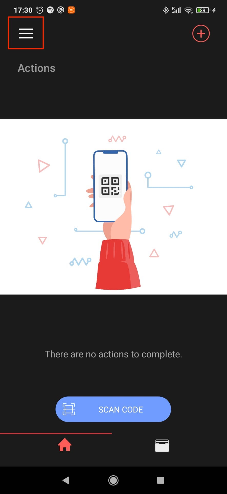
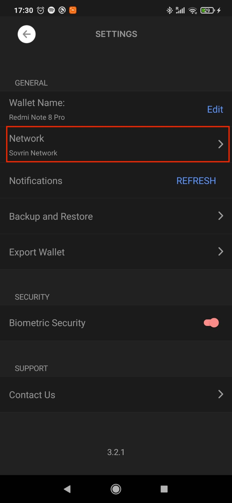
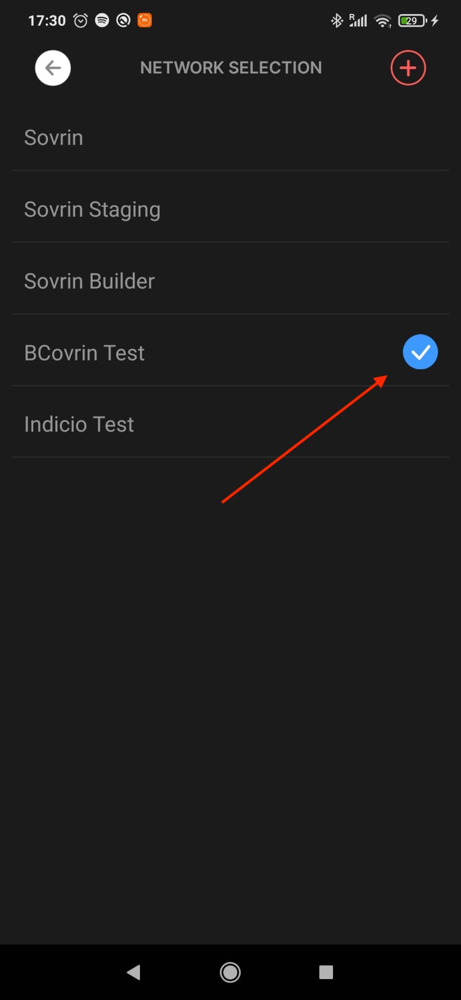

## Trinsic Wallet App Setup

1. Download the Trinsic Wallet Application on [Apple's App Store](https://apps.apple.com/us/app/trinsic-wallet/id1475160728) or [Google Play Store](https://play.google.com/store/apps/details?id=id.streetcred.apps.mobile)
2. Follow the in-app instructions to setup a wallet.
3. The welcome screen should look similar to the following Figure:
 

4. Follow the instructions on the Figures below to change to the same network as the ACA-Py agents.
 

